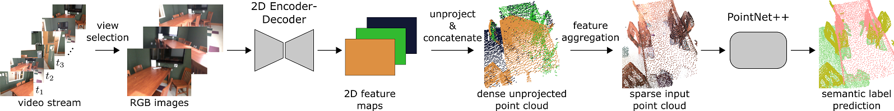

# MVPNet: Multi-view PointNet for 3D Scene Understanding


If you find our work useful, please cite our [paper](https://arxiv.org/abs/1909.13603):
```
@inproceedings{jaritz2019multi,
	title={Multi-view PointNet for 3D Scene Understanding},
	author={Jaritz, Maximilian and Gu, Jiayuan and Su, Hao},
	booktitle={ICCV Workshop 2019},
	year={2019}
}
```

## Pre-requisites
- Python 3.6
- Pytorch 1.2.0
- CUDA 10.0 & CUDNN 7.6.4

## Setup
create mvpnet enviroment:
`conda create --file environment.yml` </br>
<bold>Note:</bold> if you ran into dependencies problem during installation, try this:
```bash
conda create --name mvpnet
conda activate mvpnet
pip install torch==1.3.0+cu100 torchvision -f https://download.pytorch.org/whl/torch_stable.html
pip install future setuptools==59.5.0  yacs numpy scipy scikit-learn h5py tqdm cython natsort tabulate pytest opencv-python matplotlib plyfile
```

create py27 enviroment (only to create 2D dataset)
```bash
conda create --name py27
conda activate py27
pip install --quiet numpy  imageio==1.4 opencv-python==4.2.0.32
```

## Compile CUDA scripts (requires CUDA)
```bash
conda activate mvpnet
cd mvpnet/ops/
python setup.py build_ext --inplace
```

## Create 2D dataset `scannet/2d_scannet`
this script runs on python2.7
```bash
conda activate py27
python ./custome_extractor.py
```
## Resize and create final dataset `scannet/scans_resize_160_120`
```bash
conda activate mvpnet
python ./custome_resize_scannet.py
```

### Finalize data
run this before running any train/test script
```bash
conda activate mvpnet
python ./final_injection.py
```

## Create pickle cache files
result of these scripts will be saved into `dataset/pickles`

- for train:

`python mvpnet/data/preprocess/preprocess.py -o /content/dataset/pickles -s train --rgbd`

- for validation:

`python mvpnet/data/preprocess/preprocess.py -o /content/dataset/pickles -s val --rgbd`

- for test (alittle more tricky):

`python mvpnet/data/preprocess/preprocess.py -o /content/dataset/pickles -s val --rgbd --all`


last script will create a file named `scannetv2_all.pickle` in `dataset/pickles`, please manually rename this file into `scannetv2_test.pickle`


## Train
train 2D model (Resnet34):

```bash
conda activate mvpnet
python mvpnet/train_2d.py --cfg configs/scannet/unet_resnet34.yaml
```

train MVPNet model (2D + feature aggregation + 3D)

```bash
python mvpnet/train_mvpnet_3d.py --cfg configs/scannet/mvpnet_3d_unet_resnet34_pn2ssg.yaml --epochs 20
```

change `--epoch 20` if you like to train more.

## Test
test 2D model on 2D labels:

`python mvpnet/test_2d.py --cfg configs/scannet/unet_resnet34.yaml`

test 2D model on 3D chunks:

`python mvpnet/test_2d_chunks.py --cfg configs/scannet/unet_resnet34.yaml --cache-dir /content/dataset/pickles --image-dir /content/dataset/scans_resize_160x120`

test MVPNet model:

`python mvpnet/test_mvpnet_3d.py --cfg configs/scannet/mvpnet_3d_unet_resnet34_pn2ssg.yaml  --num-views 5 --cache-dir /content/dataset/pickles --image-dir /content/dataset/scans_resize_160x120`

## Visualize
### Ground Truth from single scene:

`python visualize.py --id scene0018_00`

value for `--id` will be loaded from  scannet directory path or the path defined in `SCANNET_DIRECTORY`, only copy and paste to sample folder name.

### generate inference samples:
`python generate_random_scenes.py --save_dir /somewhere/path/ --count 10`
- `--count` how many samples to generate
- `--save-dir` where to save samples

this script needs `dataset/2d_scannet`. make sure you already completed section regarding to create 2D dataset

### 3D search without MVPNet, for single inference sample:
`python 3d_search.py --target /path/to/samples/684`
- `--target` path to one of the generated samples, the `684` represent one of the samples' directory name

### 3D search with MVPNet, for single inference sample:
`python 3d_search.py --target /path/to/samples/684 --mvpnet --label cabinet`
- `--target` same as before.
- `--mvpnet` will segment unprojection using model
- `--label` extract specific label from unprojection and remove the rest.

## Test 3D search and get confusion matrix:
`python query_search.py --label cabint`
- `--label` run tests on specific label
- `--keep` how many samples to load and run tests
- `--skip` how many to skip between samples in querying

## Getting segmentation for whole scene
follow this instructions:
- pick one sample from `mvpnet/data/meta_files/scannetv2_val.txt`, which in my case is `scene0018_00`
- if you haven't already run cache for validation pickles, run this:
  - `python .\mvpnet\data\preprocess\preprocess.py -s val -o ..\dataset\scannet\pickles\ --rgbd`
  - note that we do need validation pickle for segmentation
- now the final command:
  - `python .\visualize.py --id scene0018_00 --predict`
  - running this script will result to pop up two windows on after another,
  - first one is the **Ground truch** for `scene0018_00`
  - and the second one is `MVPNet segmentation` for that scene.
  

## License
The code is released under the MIT license.
Copyright (c) 2019
