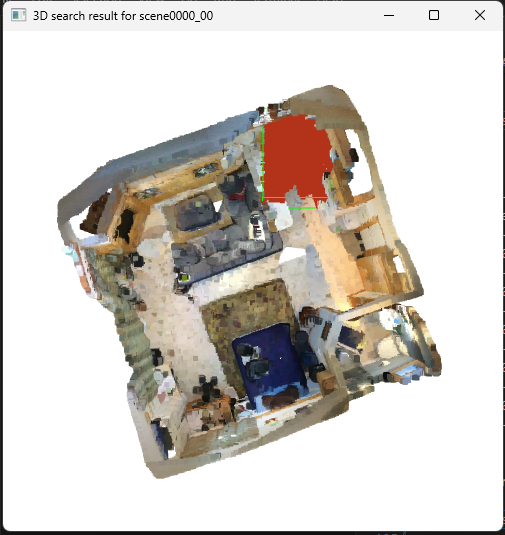

# MVPNet: Multi-view PointNet for 3D Scene Understanding

If you find our work useful, please cite our [paper](https://arxiv.org/abs/1909.13603):
```
@inproceedings{jaritz2019multi,
	title={Multi-view PointNet for 3D Scene Understanding},
	author={Jaritz, Maximilian and Gu, Jiayuan and Su, Hao},
	booktitle={ICCV Workshop 2019},
	year={2019}
}
```

# Quick Access
[1. Setup CUDA](#compile-cuda-scripts)\
[2. Preprocessing Data (Scannet Dataset)](#data-preprocessing)\
[3. Train and Test](#train)\
[4. Running scripts](#scripts)

# Compile CUDA scripts

this is required only if you 1. have nvidia graphic card on your device 2. you want to run MVPNet model.

```bash
conda activate mvpnet
cd mvpnet/ops/
python setup.py build_ext --inplace
```

# Data Preprocessing

this script requires python2.7 or similar :
```bash
conda activate py27
# Note: run this commands at repo's root directory
# this will generate 2D dataset.
python ./preprocessing/custome_extractor.py
```
the result of the process requires a typical python3 enviroment :
```bash
# check envirment.yaml to generate mvpnet env.
conda activate mvpnet

# inject 2D labels into 2D dataset
python ./preprocessing/custome_label_injection.py
# resize entire 2D dataset into 120x160
python ./preprocessing/custome_resize_scannet.py
# copy all required data from scan's dataset into resized directory
python ./preprocessing/final_injection.py

# generate pickle files (for caching purpose)
# kindly note that the "pickles" folder should already exists
python mvpnet/data/preprocess/preprocess.py -o ../dataset/pickles -s train --rgbd

python mvpnet/data/preprocess/preprocess.py -o ../dataset/pickles -s val --rgbd

python mvpnet/data/preprocess/preprocess.py -o ../dataset/pickles -s test --rgbd --all
```

# Train
first head to `./configs` folder and change parameters.

train 2D model (Resnet34):

```bash
conda activate mvpnet
python mvpnet/train_2d.py --cfg configs/scannet/unet_resnet34.yaml --split train
```

train MVPNet model (2D + feature aggregation + 3D)

```bash
python mvpnet/train_mvpnet_3d.py --cfg configs/scannet/mvpnet_3d_unet_resnet34_pn2ssg.yaml --epochs 20 --split train
```

change `--epoch 20` if you like to train more.

# Test
test 2D model on 2D labels:

`python mvpnet/test_2d.py --cfg configs/scannet/unet_resnet34.yaml --split test`

test 2D model on 3D chunks:

`python mvpnet/test_2d_chunks.py --cfg configs/scannet/unet_resnet34.yaml --cache-dir /content/dataset/pickles --image-dir /content/dataset/scans_resize_160x120 --split test`

test MVPNet model:

`python mvpnet/test_mvpnet_3d.py --cfg configs/scannet/mvpnet_3d_unet_resnet34_pn2ssg.yaml  --num-views 5 --cache-dir /content/dataset/pickles --image-dir /content/dataset/scans_resize_160x120 --split test`

# Scripts
## 1. Generate inference samples
`python generate_random_scenes.py --save_dir /somewhere/path/ --count 10`
- `--count` how many samples to generate
- `--save-dir` where to save samples

this script needs `dataset/2d_scannet`. make sure you already completed section regarding to create 2D dataset

## 2. Ground Truth from single scene


first list all available samples that could be viewed:

`python ./scripts/scene_ground_truth.py --list-all`

you'll get something like this printed out in your terminal:
```
+--------------------+
| Available scan IDs |
+--------------------+
|    scene0000_00    |
+--------------------+
|    scene0011_00    |
+--------------------+
|    scene0018_00    |
+--------------------+
|    scene0031_02    |
+--------------------+
|    scene0447_02    |
+--------------------+
```

now view ground truth from one of the samples listed above:

`python .\scripts\scene_ground_truth.py --scene scene0000_00`

## 3. Object spot using KNN
<p float="left">
  
   
</p>

```bash
python ./scripts/3d_search.py --target /path/to/samples/684
```

(in case of problem, consider intalling pandas: `pip install pandas`)

> `--target` will get the path of generated sample; `684` represent one of the samples' directory name
  
> Note: in case you want to find best candidates with maximum RMSE instead of minimum, use `--rmse-max` :

```bash
python ./scripts/3d_search.py --target /path/to/samples/684 --rmse-max
```
  
also the score report will be saved into `/path/to/samples/684/report/rmse.csv` for further use.
 
## 4. Object spot will Segmentation included


```bash
python ./scripts/3d_search.py --target /path/to/samples/684 --mvpnet --load ./dataset/cache/scene0000_00.pickle
```
- `--target` same as before.
- `--mvpnet` will segment unprojection using model
- `--label` extract specific label from unprojection and remove the rest.

## 5. Scene segmentation


```bash
python ./scripts/mvpnet_segmentation.py --scene scene0000_00
```

if you already saved segmentation into pickle file, use:
```bash
python ./scripts/mvpnet_segmentation.py --scene scene0000_00 --load ./scene0000_00.pickle
```
## 6. Image's segmentation Ground Truth
<p float="left">
  
   
</p>

```bash 
python ./scripts/image_ground_truth.py --label ../dataset/scannet/cache/2d_labels/4464.png
```

## 7. Segmentation for 2D samples
```bash
python ./scripts/unet_segmentation.py --image ../inference/1334/1334.jpg --load ../dataset/scannet/cache/unet/1334.pickle
```

## 8. Scene segmentation with 2D chunks
```bash
python ./scripts/2d_chunks_segmentation.py --scene scene0000_00 --load ../dataset/scannet/cache/chunks/scene0000_00.pickle
```

## License
The code is released under the MIT license.
Copyright (c) 2019
